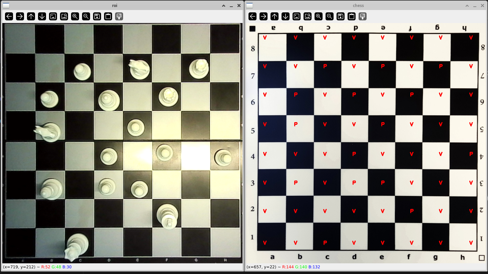

# Chess Piece Classification using Computer Vision and Machine Learning

This project aims to classify chess pieces using computer vision and machine learning techniques. 

### Objective:

The objective of the classification is to identify the cells that contain chess pieces in order to analyze the moves and implement a chess engine such as Stockfish to play with it. 

### Technologies Used:

Computer Vision: OpenCV for image processing tasks.
Machine Learning: TensorFlow/Keras for building and training models.
    

**If you're interested in the project and would like to know more about how the implementation was done, stay tuned! The detailed description and documentation of the project will soon be added to the repository's Wiki.**

